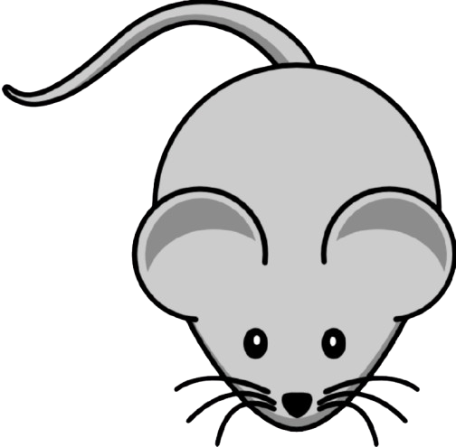
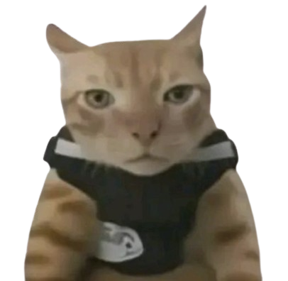
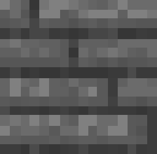
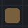
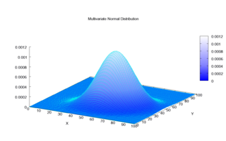
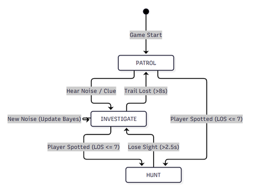
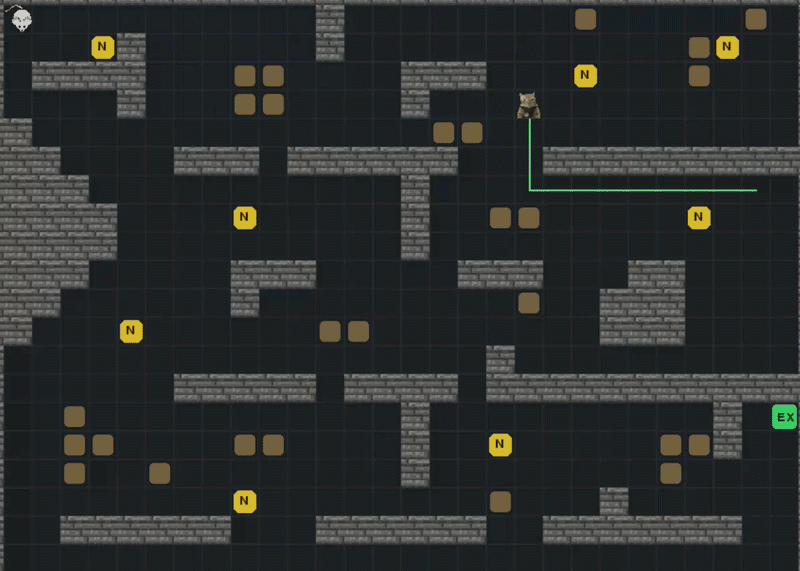

# **Omniscient Leading The Blind**: Simple, Directed Stalker Agent 👽 — `main`

<p style="display: inline">
  
  
</p>


Game berbasis web yang di-deploy pada github.io bertema *stealth-survival* dengan inspirasi dari sistem AI Alien pada game [Alien: Isolation](https://en.wikipedia.org/wiki/Alien:_Isolation) (2014) yang dibentuk ke dalam world 2 dimensi semacam labirin seperti [Pac-man](https://en.wikipedia.org/wiki/Pac-Man).

Secara singkat, player ditugaskan menuju tile exit tanpa tertangkap oleh Alien. Player akan menghasilkan noise setiap kali bergerak serta akan dikejar jika membentuk jalur pandang (line of sight) terhadap Alien.

Entitas yang dihadapi oleh player sebenarnya ada 2; Director dan Alien. Director merupakan sistem noise yang selalu tahu posisi asli player dan akan memberi clue pada Alien berupa noise di posisi sekitar player untuk mengarahkan Alien. Director juga dapat menghukum player yang diam saja selama 30 detik dengan memberikan informasi posisi yang jauh lebih akurat pada Alien.

Alien sendiri memiliki dasar sistem bayesian network berupa nilai kemungkinan normal ([0,1]) kehadiran player di setiap tile yang mungkin dilewati player dan akan memperbarui nilai tersebut sesuai posisi clue terbaru ada di mana. Terdapat tambahan sistem berupa prediksi arah gerakan player jika didapati tile dengan kemungkinan tinggi ternyata player tidak hadir di sekitar tile tersebut saat Alien sampai.

## Daftar Isi
| Development | Misc |
| --- | ---
|[🔗 **Web Game**](#-web-game) | 🧑‍🤝‍🧑 [**Tim Proyek**](#tim-proyek--nama-kelompok-b-a-k-e-k-o-k)
|[🧩 **Elemen Game**](#-elemen-game) | 📝 [**Referensi**](#referensi-dan-inspirasi)
|[⌨️ **Mapping Kontrol**](#️-mapping-kontrol-keyboard-bind) | 
|[⚙️ **Mekanisme Game**](#️-mekanisme-game---in-detail) |

## 🔗 Web Game
**`Stalker AI - Bayesian Alien`** ([**github.io**](https://satriyoramadhan2005-art.github.io/AI-Final-Project/)) atau bisa salin link berikut
```bash
https://satriyoramadhan2005-art.github.io/AI-Final-Project/
```
## 🧩 Elemen Game
| **Elemen**    | **Penampilan** | <p align="center">**Deskripsi**</p> |
| :---:     | :---:      | :--- 
| **`Player`** |  | Penjelasan kontrol dari input user ada [**di sini**](#️-mapping-kontrol-keyboard-bind)
| **`Alien`** |  | `Alien` dalam mode **Patrol**
| - |  | `Alien` dalam mode **Investigate**
| - |  | `Alien` dalam mode **Hunt**
| **`Wall`** |  | Menghalangi vision dan pergerakan `Player` ataupun `Alien`
| **`obstacle`** |  | Membatasi **pergerakan saja**, berlaku untuk `Player` ataupun `Alien`
| **`Noise Generator`** |  | Dapat menghasilkan **noise** berbentuk lingkaran melebar di game. Noise dianggap sebagai **clue** dan akan menarik perhatian `Alien`. Detail `Generator` dan mekanisme **noise** ada [**di sini**](#️-mekanisme-game)
| **`Exit`** | | `Player` **memenangkan** game jika berhasil mencapai tile ini **tanpa tertangkap** `Alien`

> Tile yang dapat dilalui `player` ataupun `alien` tampak **transparan** dan **tidak** menggunakan tekstur (aset) khusus

## ⌨️ Mapping Kontrol (Keyboard Bind)
*`Arrow-keys`* untuk menggerakkan *player* ke arah sesuai inputnya dan beberapa tombol *`support`* berikut
| **Tombol**        | <p align="center">**Deskripsi**</p> |
| :---:             | :---
| **`E/Space`**     | Menyalakan `Generator` yang ada **adjacent** (bersampingan) terhadap player
| **`Shift`**       | Tahan bersama input arah dari `arrow-keys` untuk berlari
| **`B`**           | Toggle overlay warna tile sesuai *Belief Map* dan tampilkan informasi jalur gerakan `Alien`
| **`R`** | **Restart** game. Bisa dilakukan di tengah permainan atau setelah **tertangkap** maupun **menang**

> Input melalui *`Arrow-keys`* tanpa *`Shift`* tetap menggerakkan player tapi dalam mode **berjalan**

**[⬆ Kembali ke Daftar Isi ⬆](#daftar-isi)**

## ⚙️ Mekanisme Game - In Detail
### 3.1 Player 🐭
Player dapat bergerak pada seluruh tile yang transparan (selain `wall` atau `obstacle`) dalam mode jalan atau lari. Game akan langsung selesai saat Player berhasil menduduki tile `Exit` atau Player menabrak `Alien`

### 3.1 Noise 🔊 dan Generator 📢
Noise hanya diberikan oleh `Director` atau 'dihasilkan' jika `Player` bergerak. Selain itu, objek Generator juga dapat menghasilkan noise jika di-trigger secara manual oleh `Player` atau `timer malfungsinya` habis sementara kondisi saat ini adalah ready (*cooldown* 18 detiknya selesai). Clue hasil Generator bisa digunakan `Player` untuk me-'*reset*' **belief** dari `Alien` hingga mengecohnya untuk datang ke Generator yang baru saja aktif

> ## Noise
> Noise (selanjutnya disebut clue) merupakan tanda **x** disertai lingkaran yang diberikan oleh `Director` untuk membantu perhitungan *belief map* `Alien` atau dihasilkan generator untuk mengecoh `Alien`. 
>
> Noise memiliki dasar bentuk distribusi [**Gaussian 2 dimensi**](https://en.wikipedia.org/wiki/Multivariate_normal_distribution) dengan pusat di tile yang dipilih secara acak lalu menyebar menuju sekitarnya. Tile di pusat akan memiliki probabilitas kehadiran player paling tinggi berdasarkan clue.
>
> 

> ## Timer Malfungsi
> Setiap generator awalnya memiliki waktu acak **35-60 detik** (secara [**uniform**](https://brilliant.org/wiki/uniform-probability/)) saat game dimulai
> 
> Jika timer tersebut **mencapai 0** dan *cooldown* generator juga sudah selesai, maka generator akan malfungsi; yaitu membuat noise secara otomatis, tidak bisa digunakan selama 18 detik *cooldown*, dan mendapat timer malfungsi baru selama **45-80 detik**
>
> Setiap kali generator diaktifkan secara manual oleh Player, timer malfungsi diacak kembali menjadi 45-80 detik

**[⬆ Kembali ke Daftar Isi ⬆](#daftar-isi)**

### 3.2 Alien (👽 = 🐈)
1. **State**

    Sesuai ada tidaknya clue serta posisi `Player`, Alien dapat berganti state menuju salah satu dari 3 kondisi sesuai logika **flowchart** di bawah.

    

    > LOS: *Line of Sight*
    
    **Patrol.** Berjalan mengunjungi beberapa node yang sudah ditentukan dengan urutan node terdekat posisi saat ini
    
    **Investigate.** Mengunjungi clue dari `Director` atau generator lalu mengikuti pembaruan *belief map* serta prediksi model Difusi. 
    
    **Hunt.** Saat `Player` berada pada radius 7 tile di sekeliling `Alien` dan tidak ada `wall` yang menghalangi vision `Alien`. `Alien` akan mengejar `Player` selama posisi `Player` masih di dalam jangkauan visionnya.

2. **Bayesian Belief Network/Map**

    Setiap *frame/tick*, `Alien` menghitung kemungkinan `Player` ada pada setiap tile di map (*individually*) yang ditandai dengan warna merah. Perhitungan ini sangat bergantung pada clue serta model Difusi. Berkaitan dengan bentuk clue berupa distribusi Gaussian 2 dimensi, belief map akan sejalan dengan relasi berikut.


    **<p align="center"> Posterior(tile)  ∝  P(tile | clue position) * P(tile)</p>**
    
    **<p align="center"> `P(T | clue position)  ∝  P(clue position | T) * P(T)`</p>**

    Kemungkinan `Player` ada di Tile *given* posisi clue yang diberikan sebanding dengan kemungkinan clue ditaruh di posisi tersebut jika given posisi `Player` memang ada di tile T dikali kemungkinan awal tile tersebut.

    > notice: penulisan di laporan ternyata terbalik untuk bayes rulenya 😔

3. **Bayesian Diffusion Model**

    Model prediksi sederhana di mana setiap *frame/tick*, seluruh tile akan membagi sebanyak **30%** nilai *belief*-nya ke tile tetangga yang walkable. Fungsinya adalah melakukan prediksi ke arah manakah `Player` berpindah jika `Alien` sampai pada tile dengan probabilitas kehadiran `Player` tertinggi tapi tidak ditemukan adanya `Player` di sekitar.

    

    Model ini hanya digunakan saat `Alien` berada di mode `Hunt` atau `Investigate` dan tampak pada ilustrasi berupa perubahan gradasi warna merah tile *walkable* menuju beberapa area yang mungkin jadi tujuan player. 

4. **Negative Evidence**

    Tile yang sudah dilihat `Alien` tapi tidak ada `Player`-nya akan dievaluasi ulang untuk mengurangi probabilitas hadirnya `Player` di sana secara drastis. 
    
    Tampak pada gif ilustrasi di atas; `Alien` seperti menyapu area tile berwarna merah di sekitarnya menjadi netral kembali.

## Tim Proyek | Nama Kelompok B A K E K O K
* Tsaqif Jalaluddin Ahmad | [**dhornii**](https://github.com/dhornii) - 24/537665/TK/59611
* Raalfhi Yholano | [**raalfhiyholano**](https://github.com/raalfhiyholano) - 24/534528/TK/59251
* Satriyo Ramadhan | [**satriyoramadhan2005-art**](https://github.com/satriyoramadhan2005-art) - 24/540384/TK/59958

## Referensi dan Inspirasi

1. Zhen, Y., Wanpeng, Z., Hongfu, L. (2019). Real-time Strategy Game Tactical Recommendation Based on Bayesian Network. IOP Conf. Series: Journal of Physics: Conf. Series, 1168, 032018. [doi.org/10.1088/1742-6596/1168/3/032018](doi.org/10.1088/1742-6596/1168/3/032018) 
2. Deepia. (2025, May 27). Diffusion Models: DDPM | Generative AI Animated. [Video]. https://www.youtube.com/watch?v=EhndHhIvWWw 
3. NoBS Code. (2024, July 6). Bresenham's Line Algorithm - Demystified Step by Step. [Video]. https://www.youtube.com/watch?v=CceepU1vIKo 
4. Andre Prihodko. (2023, September 24). How Your Computer Draws Lines. [Video]. https://www.youtube.com/watch?v=8gIhNSAXYcQ 
5. Uniform Probability (by Outcomes). Brilliant.org. Retrieved from https://brilliant.org/wiki/uniform-probability/
6. Wikipedia. (2026, September 19). Multivariate normal distribution. In Wikipedia. https://en.wikipedia.org/wiki/Multivariate_normal_distribution
7. Wikipedia. (2026, September 8). Alien: isolation. In Wikipedia. https://en.wikipedia.org/wiki/Alien:_Isolation
8. Wikipedia. (2026, September 30). Pac-Man. In Wikipedia. https://en.wikipedia.org/wiki/Pac-Man

**[⬆ Kembali ke Daftar Isi ⬆](#daftar-isi)**